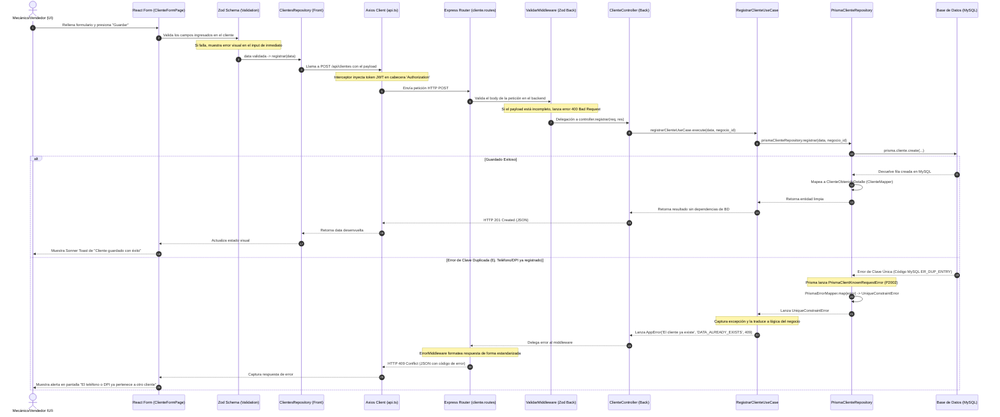

# Asyncronix - Documentación Técnica y de Arquitectura

Esta documentación proporciona una visión técnica profunda a nivel de ingeniería de la arquitectura, patrones, flujo de datos y decisiones tecnológicas del ecosistema **Asyncronix**.

---

## 1. Contexto de Negocio e Identidad Multi-Inquilino (SaaS)

Asyncronix está concebido como una plataforma SaaS (Software as a Service) multi-inquilino de alto rendimiento. Permite a múltiples negocios independientes (inquilinos/tenants) gestionar sus operaciones (taller mecánico, inventario de repuestos, servicios y facturación) de forma totalmente aislada dentro de una única base de datos física.

### Características Clave del Diseño Multi-Tenant:
*   **Aislamiento de Datos**: Cada entidad principal (usuarios, clientes, productos, sucursales, ventas, servicios, etc.) tiene una relación directa o indirecta con el modelo `Negocio` (`negocio_id`). La persistencia y las consultas siempre aplican filtros estrictos sobre el `negocio_id` obtenido de la sesión del usuario.
*   **Granularidad por Sucursal**: Dentro de un mismo negocio, la plataforma permite múltiples `Sucursales` (`sucursal_id`). Los lotes de inventario, ventas y servicios pueden estar asociados a una sucursal específica para garantizar un control logístico exacto.
*   **Control de Acceso Basado en Roles y Permisos (RBAC)**: Los roles (`Rol`) y sus permisos asociados (`Permiso`) se definen de manera personalizada para cada negocio. La seguridad se valida a nivel de API (backend) y a nivel de rutas e interfaz (frontend).

---

## 2. Pila Tecnológica (Tech Stack)

### Frontend
*   **Núcleo**: [React 19](https://react.dev/) + [TypeScript](https://www.typescriptlang.org/) + [Vite](https://vite.dev/) (empaquetado ultrarrápido y Hot Module Replacement).
*   **Interfaz de Usuario**: [Material UI (MUI v7)](https://mui.com/) con Emotion, configurado con un tema personalizado plano, minimalista, sin sombras elevadas y bordes sutiles.
*   **Gestión de Estado**: [Zustand](https://zustand-demo.pmnd.rs/) con middleware de persistencia local (`persist`) para mantener la sesión del usuario de forma reactiva y ligera.
*   **Enrutamiento**: [React Router Dom v7](https://reactrouter.com/) estructurado mediante rutas jerárquicas y carga perezosa (`Suspense` + `lazy`).
*   **Formularios y Validación**: [React Hook Form](https://react-hook-form.com/) en conjunto con [Zod](https://zod.dev/) para validación estricta y tipado estático en tiempo de compilación.
*   **Funcionalidades Especiales**:
    *   [html5-qrcode](https://github.com/mebjas/html5-qrcode) para la lectura interactiva de códigos QR de productos usando la cámara del dispositivo móvil o laptop.
    *   [framer-motion](https://www.framer.com/motion/) para micro-animaciones en transiciones de páginas.
    *   [sonner](https://sonner.emilkowal.ski/) para notificaciones tipo Toast hermosas y no intrusivas.
    *   **PWA**: Preparado mediante `vite-plugin-pwa` para ofrecer capacidades fuera de línea e instalación en pantallas de inicio.

### Backend
*   **Núcleo**: [Node.js](https://nodejs.org/) + [Express](https://expressjs.com/) configurado en modo ESM nativo (`"type": "module"`) y ejecutado dinámicamente con [tsx](https://github.com/private-face/tsx) en desarrollo.
*   **Base de Datos y Persistencia**: [MySQL](https://www.mysql.com/) administrado mediante el ORM [Prisma](https://www.prisma.io/), que proporciona migraciones estables (`prisma migrate`) y consultas seguras tipadas.
*   **Seguridad y Autenticación**:
    *   [jose](https://github.com/panva/jose) para la creación, firma y verificación asíncrona de JSON Web Tokens (JWT) mediante algoritmos modernos.
    *   [argon2](https://github.com/ranisalt/node-argon2) para el hash seguro de contraseñas de usuarios de acuerdo con estándares criptográficos de vanguardia.
*   **Validaciones y Utilidades**:
    *   [Zod](https://zod.dev/) para parsear y validar la estructura de los payloads recibidos en las peticiones HTTP (`body`, `query`, `params`).
    *   [multer](https://github.com/expressjs/multer) para el manejo y almacenamiento estructurado de archivos multimedia cargados en el servidor.
    *   [qrcode](https://github.com/soldair/node-qrcode) para la generación dinámica de códigos QR.
    *   [uuid](https://github.com/uuidjs/uuid) para generar identificadores universales únicos v4.

---

## 3. Arquitectura Limpia (Clean Architecture)

Tanto el frontend como el backend de Asyncronix están gobernados por el patrón de **Arquitectura Limpia**. Esto separa las reglas de negocio de la infraestructura tecnológica, facilitando la escalabilidad, el mantenimiento y la realización de pruebas unitarias.

### Estructura de Capas por Módulo (Simetría de Diseño)

Cada dominio operativo del sistema (por ejemplo, `cliente`, `ventas`, `productos`) se desglosa en un módulo autocontenido compuesto por tres o cuatro capas fundamentales:

```
[ Capa de Presentación ]  <--->  [ Capa de Aplicación ]  --->  [ Capa de Dominio ]
        |                                                              ^
        v                                                              |
[ Capa de Infraestructura (Implementación de Repositorios) ] ----------+
```

1.  **Capa de Dominio (`domain`)**:
    *   *Backend*: Define las entidades puras de negocio (interfaces de TypeScript) y el contrato abstracto del repositorio (`ClienteRepository`, por ejemplo). No conoce la existencia de bases de datos o bibliotecas externas.
    *   *Frontend*: Define el modelo de datos de la UI y los esquemas de validación estructural (Zod) que garantizan que la información capturada sea correcta antes de enviarla.
2.  **Capa de Aplicación (`application`)**:
    *   *Backend*: Contiene los Casos de Uso (`UseCase`). Implementan las reglas de negocio del sistema coordinando los métodos definidos en la interfaz del repositorio del dominio. Son independientes de Express o Prisma.
    *   *Frontend*: Se absorbe principalmente mediante componentes controladores, hooks personalizados y llamadas directas de orquestación en tiendas de estado (Zustand).
3.  **Capa de Infraestructura (`infrastructure`)**:
    *   *Backend*: Contiene las tecnologías de persistencia y comunicación externa. Por ejemplo, `PrismaClienteRepository` implementa el contrato de `ClienteRepository` usando el cliente Prisma. Aquí también residen los mapeadores de datos (`Mappers`).
    *   *Frontend*: Contiene la implementación concreta de los repositorios de API que hacen solicitudes HTTP utilizando el cliente `api` de Axios.
4.  **Capa de Presentación (`presentation`)**:
    *   *Backend*: Contiene los controladores (`Controller`) que reciben peticiones HTTP, delegan la lógica a los Casos de Uso correspondientes y formatean las respuestas. También incluye la definición de rutas (`routes.ts`) expuestas a Express.
    *   *Frontend*: Contiene los componentes visuales de React (páginas, formularios, tablas, diálogos) y los estilos de interfaz.

---

## 4. Patrones de Diseño Implementados

### 4.1. Repository Pattern (Patrón Repositorio)
Desacopla la lógica de negocio de los detalles de almacenamiento. El caso de uso solo interactúa con un contrato de repositorio abstracto:

*   **Definición (Dominio)**: [cliente.repository.ts](file:///Applications/asyncronix/saas-backend/src/modules/cliente/domain/cliente.repository.ts)
*   **Implementación (Infraestructura)**: [prisma-cliente.repository.ts](file:///Applications/asyncronix/saas-backend/src/modules/cliente/infrastructure/prisma-cliente.repository.ts)

Esto permite cambiar el motor de base de datos o el ORM en cualquier momento reemplazando únicamente la infraestructura, sin tocar una sola línea de código del dominio o los casos de uso.

### 4.2. Mapper Pattern (Patrón Mapeador)
Aísla las estructuras internas de base de datos generadas por el ORM de las entidades expuestas al resto de la aplicación.
*   El mapeador toma los modelos autogenerados de Prisma (que contienen relaciones circulares o tipos crudos de la BD) y los transforma en interfaces de dominio limpias y coherentes (`ClienteObtenidoDetalle`, `ClienteSimple`).
*   Esto previene el acoplamiento directo y reduce la sobrecarga de datos en la red al excluir campos innecesarios (como contraseñas, ids redundantes, etc.).

### 4.3. Dependency Injection (Inyección de Dependencias Manual)
Para mantener las clases desacopladas y altamente testeables, los Casos de Uso reciben sus dependencias a través de sus constructores.
En la raíz de cada módulo (por ejemplo, [cliente.module.ts](file:///Applications/asyncronix/saas-backend/src/modules/cliente/cliente.module.ts)), se instancian las clases y se inyectan manualmente:

```typescript
const clienteRepository = new PrismaClienteRepository(prisma);
const registrarClienteUseCase = new RegistrarClienteUseCase(clienteRepository);
export const clienteController = new ClienteController(
    obtenerClienteUseCase,
    obtenerClientesUseCase,
    registrarClienteUseCase,
    actualizarClienteUseCase,
    eliminarClienteUseCase,
    buscarClientePorDocumentoUseCase
);
```

### 4.4. Custom Database Error Mapping
El backend captura los errores específicos de Prisma en la infraestructura (como violaciones de restricciones de clave única, códigos `P2002`, o registros no encontrados `P2025`) y los traduce inmediatamente a excepciones de persistencia agnósticas (`UniqueConstraintError`, `NotFoundPersistenceError`).
Esto evita que errores del motor de base de datos se filtren a las capas de negocio superiores y rompan el principio de abstracción.

---

## 5. Arquitectura de Directorios

### Estructura del Backend (`saas-backend/`)
```
saas-backend/
├── prisma/
│   ├── schema.prisma          # Definición completa del esquema relacional MySQL
│   └── seed.ts                # Inicializador de base de datos (datos maestros y demos)
├── src/
│   ├── app.ts                 # Configuración de Express (CORS, Parsers, Cookies)
│   ├── server.ts              # Inicialización y arranque del servidor HTTP
│   ├── app/
│   │   └── middlewares/       # Middlewares globales (Auth, Validaciones, Control de Errores)
│   ├── infrastructure/
│   │   └── config/            # Instancias de Prisma Client y Multer Config
│   ├── routes/
│   │   └── index.routes.ts    # Enrutador centralizado con carga de módulos dinámica
│   ├── shared/                # Lógica compartida entre todos los módulos del backend
│   │   ├── database/          # Mapeadores de errores Prisma globales e interfaces base
│   │   ├── domain/            # Definiciones de paginación y contratos compartidos
│   │   ├── errors/            # Excepción global AppError usada por toda la aplicación
│   │   └── presentation/      # Helper para validaciones genéricas y controladores abstractos
│   └── modules/               # Módulos operativos estructurados en Clean Architecture
│       ├── auth/
│       ├── cliente/
│       │   ├── application/   # Casos de uso (Registrar, Obtener, Eliminar, etc.)
│       │   ├── domain/        # Entidades puras y contrato del repositorio
│       │   ├── infrastructure/# Implementación PrismaRepository y mappers
│       │   ├── presentation/  # Controlador Express y definición de rutas del módulo
│       │   └── cliente.module.ts # Contenedor de cableado e inyección de dependencias
│       ├── producto/
│       ├── ventas/
│       └── ... (otros módulos: sucursal, rol, categoria, etc.)
```

### Estructura del Frontend (`saas-frontend/`)
```
saas-frontend/
├── src/
│   ├── main.tsx               # Punto de entrada de React 19
│   ├── App.tsx                # Renderizador principal del enrutador y proveedor de Toasts
│   ├── index.css              # Estilos CSS globales y variables de diseño
│   ├── core/                  # Configuraciones estructurales de la aplicación
│   │   ├── api/               # Cliente Axios, interceptores de tokens y control de errores API
│   │   ├── store/             # Tiendas de estado Zustand con persistencia local (authStore.ts)
│   │   └── theme/             # Configuración del tema personalizado de Material UI (mainTheme.ts)
│   ├── shared/                # Componentes y páginas compartidas a lo largo de los módulos
│   │   ├── components/        # Protectores de rutas, loaders, layouts visuales
│   │   └── pages/             # Páginas genéricas (Acceso Denegado, Error 404, etc.)
│   ├── presentation/          # Diseños estructurales generales (Sidebar, Navbar, Layouts)
│   └── modules/               # Módulos operativos de cliente estructurados
│       ├── clientes/
│       │   ├── domain/        # Interfaces y validación de esquemas Zod (cliente.schema.ts)
│       │   ├── infrastructure/# Clientes de API Axios e implementaciones del repositorio
│       │   └── presentation/  # Componentes visuales de React, páginas y rutas locales
│       ├── ventas/
│       ├── productos/
│       └── ... (otros módulos: categorias, lotes, usuarios, roles, sucursales, etc.)
```

---

## 6. Flujo de Datos del Sistema (Data Flow)

El siguiente diagrama ilustra el flujo de una petición típica (por ejemplo, el registro de un nuevo cliente) desde que el usuario interactúa en la interfaz visual de React hasta que los datos quedan persistidos de forma segura en MySQL, detallando la interacción de capas y el mapeo de errores.



---

## 7. Seguridad y Autorización (RBAC)

Asyncronix cuenta con un sistema robusto de seguridad distribuida entre frontend y backend:

### Backend: Validación Auténtica en Capas
El backend nunca confía en el estado del cliente. Las rutas protegidas aplican middlewares secuenciales:
1.  **`protegerRuta`**: Extrae el token JWT de la cabecera `Authorization: Bearer <token>`, valida la firma usando la clave secreta configurada con la biblioteca `jose` y verifica su fecha de expiración. Al ser exitoso, inyecta la información del usuario autenticado en `res.locals.usuario` para que las capas posteriores conozcan el `negocio_id` y `sucursal_id` de forma segura.
2.  **`verificarPermiso(permisosRequeridos)`**: Middleware granular de verificación. Compara el arreglo de permisos incrustados en el JWT del usuario contra los permisos requeridos por la ruta. Si falta alguno, interrumpe el flujo y retorna de inmediato un error `HTTP 403 Forbidden`.

### Frontend: Protección de Rutas Reactivas
En la aplicación React, las rutas hijas del sistema están envueltas en el componente declarativo `<RouteProtector>` en [appRouter.tsx](file:///Applications/asyncronix/saas-frontend/src/presentation/routers/appRouter.tsx):
*   Este componente lee reactivamente el estado de autenticación y los permisos del usuario desde la tienda global Zustand (`useAuthStore`).
*   Si el usuario no está autenticado, lo redirige inmediatamente al login conservando la ubicación anterior en el historial para permitir el retorno automático después de iniciar sesión.
*   Si el usuario intenta ingresar de forma manual mediante la barra de direcciones de su navegador a una sección para la cual no tiene permisos (por ejemplo, `/usuarios`), el `RouteProtector` lanza una notificación visual a través de Sonner Toast con la advertencia "Acceso denegado" y lo redirige a la página personalizada `/acceso-denegado`.

---

## 8. Conclusión

El ecosistema de **Asyncronix** está diseñado bajo los más altos estándares modernos de ingeniería de software. La estricta adopción de **Clean Architecture** permite que tanto el frontend como el backend evolucionen de manera independiente, facilitando que nuevos desarrolladores se incorporen al proyecto y comprendan su lógica en minutos gracias a la simetría modular y a los patrones de desacoplamiento explicados en esta guía.
